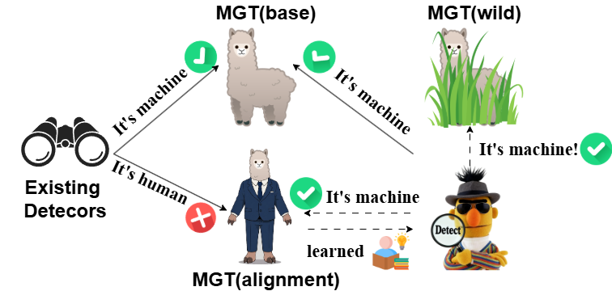
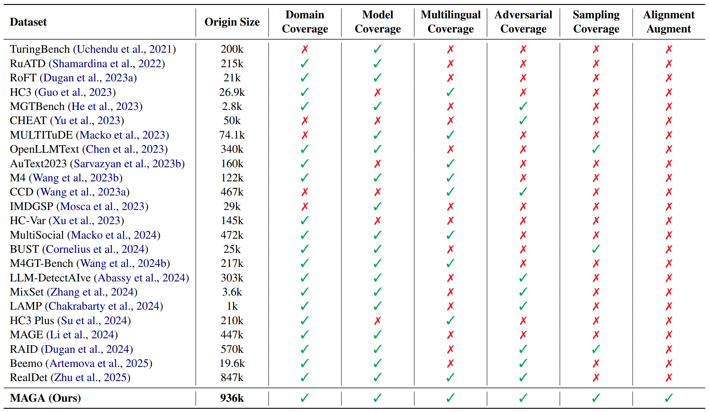
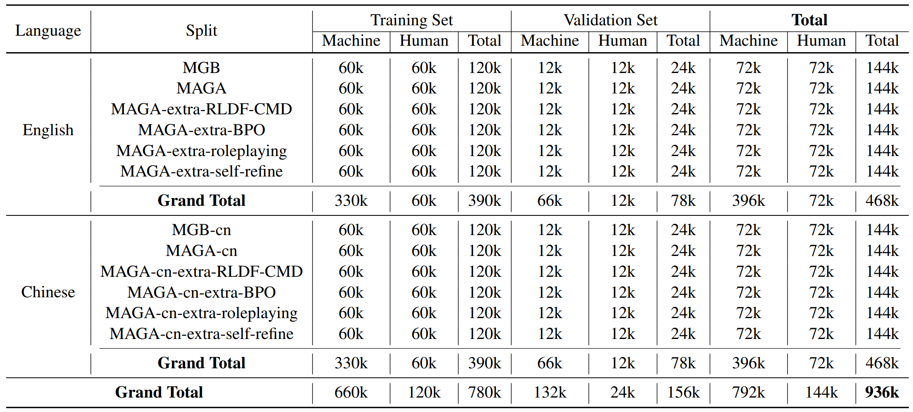

<p align="center">
     <br>
</p>
<p align="center">
<a href="https://github.com/s1012480564/MAGA/blob/main/LICENSE">
</a>
<a href="https://www.arxiv.org/abs/2601.04633">
</a>
<a href="https://huggingface.co/datasets/anyangsong/MAGA">
</a>
<a href="https://huggingface.co/anyangsong/MGT-Detector-RB-MAGA">
</a>
</p>

**This is the official repository for "[Machine-Augment-Generated Text via Alignment Detection Benchmark](https://www.arxiv.org/abs/2601.04633)".** 

## Introduction

Large Language Models (LLMs) alignment is constantly evolving. Machine-Generated Text (MGT) is becoming increasingly difficult to distinguish from Human-Written Text (HWT). This has exacerbated abuse issues such as fake news and online fraud. Fine-tuned detectors' generalization ability is highly dependent on dataset quality, and simply expanding the sources of MGT is insufficient. Further augment of generation process is required. According to HC-Var's theory, enhancing the alignment of generated text can not only facilitate attacks on existing detectors to test their robustness, but also help improve the generalization ability of detectors fine-tuned on it. Therefore, we propose **M**achine-**A**ugment-**G**enerated Text via **A**lignment (MAGA). MAGA pipeline enables comprehensive alignment from prompt construction optimization, to RL adversarial fine-tuning (Reinforced Learning from Detectors Feedback - Cross Model&Domain, RLDF-CMD) and to inference process optimization. MAGA successfully circumvents existing detectors, and at the same time, the RoBERTa detector fine-tuned on the MAGA training set delivers improved generalization detection performance on multiple well-known external datasets. We expect MAGA to provide indicative significance for future research on the generalization detection ability of detectors.
<p align="center">
     <br>
</p>

## MAGA Dataset

The MAGA dataset contains nearly 1 million generations from 12 Generators, 20 Domains (10 English + 10 Chinese), 4 Alignment Methods, and various Decoding Strategies:

| Category                | Values                                                       |
| ----------------------- | ------------------------------------------------------------ |
| **Generators**          | GPT-4o-mini, Gemini-2.0-flash, DeepSeek-V3, Qwen3-plus, Mistral-Medium, Hunyuan-TurboS, Llama-3.1-8B-Instruct, gemma-3-12b-it, DeepSeek-R1-0528-Qwen3-8B, Qwen3-8B, Ministral-8B-Instruct-2410, Hunyuan-7B-Instruct |
| **Domains**             | **English:** Reddit, S2ORC, Wikipedia, wikiHow, Trustpilot Reviews, Amazon Reviews, Yahoo Answers, Natural Questions, CC News, NPR News;<br />**Chinese:** Baidu Tieba, Weibo Review, Rednote Review, CSL, Baidu Baike, Dianping, Douban Review, Baidu Zhidao, Zhihu, CLTS |
| **Alignment Methods**   | BPO, Roleplaying, Self-Refine, RLDF-CMD (fully-fused MAGA integrates these four methods) |
| **Decoding Strategies** | Assign different values to each generator. For open-source models, use the values specified in the official `generation_config.json` file. For closed-source models, adopt the recommended values from the official `Technical Report`; if the values are unknown, use the default values of vllm. See our paper for details. |

### Comparison

<p align="center">
     <br>
</p>

Download our dataset from the Hugging Face Hub:

```bash
# English Version
huggingface-cli download --repo-type dataset anyangsong/MAGA --local-dir /path/to/MAGA
```

```bash
# Chinese Version
huggingface-cli download --repo-type dataset anyangsong/MAGA-cn --local-dir /path/to/MAGA-cn
```

Both repositories are structured by data splits:

```text
MAGA/
├── train/
│   ├── MGB_train.jsonl/
│   └── MAGA_train.jsonl/
├── val/
│   ├── MGB_val.jsonl/
│   └── MAGA_val.jsonl/
└── extra/
    ├── train/
    │   ├── MAGA_extra_train_BPO.jsonl
    │   ├── MAGA_extra_train_RLDF_CMD.jsonl
    │   ├── MAGA_extra_train_role_playing.jsonl
    │   └── MAGA_extra_train_self_refine.jsonl
    └── val/
        ├── MAGA_extra_val_BPO.jsonl
        ├── MAGA_extra_val_RLDF_CMD.jsonl
        ├── MAGA_extra_val_role_playing.jsonl
        └── MAGA_extra_val_self_refine.jsonl
MAGA-cn/
├── train/
│   ├── MGB-cn_train.jsonl/
│   └── MAGA-cn_train.jsonl/
├── val/
│   ├── MGB-cn_val.jsonl/
│   └── MAGA-cn_val.jsonl/
└── extra/
    ├── train/
    │   ├── MAGA-cn_extra_train_BPO.jsonl
    │   ├── MAGA-cn_extra_train_RLDF_CMD.jsonl
    │   ├── MAGA-cn_extra_train_role_playing.jsonl
    │   └── MAGA-cn_extra_train_self_refine.jsonl
    └── val/
        ├── MAGA-cn_extra_val_BPO.jsonl
        ├── MAGA-cn_extra_val_RLDF_CMD.jsonl
        ├── MAGA-cn_extra_val_role_playing.jsonl
        └── MAGA-cn_extra_val_self_refine.jsonl
```

The MAGA (full MAGA dataset) consists of two subsets: MAGA (English version) and MAGA-cn, with each subset containing 6 splits. For example, MAGA (English version) comprises 6 splits: MGB (baseline without alignment), MAGA (the fully-fused MAGA with 4 alignment methods), and four separate MAGA-extra-\<alignment method\> splits corresponding to each of the 4 alignment methods respectively. The same applies to MAGA-cn. Each split is further divided into two subsplits: train and validation. It should be noted that for cross-sectional comparison, the source human text used for each split is identical. In particular, for RLDF-CMD, the part generated by commercial models is directly extracted entirely from MGB. The specific statistical distribution of the number of entries is as follows:

<p align="center">
     <br>
</p>

Each JSONL record contains the following fields:
- `id`: A uuid4 that uniquely identifies the content of the text
- `title`: The title of the article used in the prompt
- `text`: The content of the text (HWT&MGT)
- `domain`: The genre from where the prompt/text was taken (e.g. Reddit)
- `human_source_id`: uuid4 of the human-written source text
- `prompt_id`: A uuid4 that uniquely identifies the prompt used
- `system_prompt`: The system prompt used for generation
- `user_prompt`: The user prompt used for generation
- `model`: The Large Language Model that generated the text
- `temperature`, `top_p`, `top_k`, `repetition_penalty`: Decoding parameters for generation

## Model

The fine-tuned detector models are available through Hugging Face. Load the models using Hugging Face [transformers](https://github.com/huggingface/transformers) library:

```python
from transformers import AutoTokenizer, AutoModelForSequenceClassification

# - Choices: ["anyangsong/MGT-Detector-RB-MGB", "anyangsong/MGT-Detector-RB-MAGA", "anyangsong/MGT-Detector-RB-MGB-cn", "anyangsong/MGT-Detector-RB-MAGA-cn"]
tokenizer = AutoTokenizer.from_pretrained("anyangsong/MGT-Detector-RB-MAGA")
model = AutoModelForSequenceClassification.from_pretrained("anyangsong/MGT-Detector-RB-MAGA")
```

The labels used during our training are defined as follows: HWT is assigned a label value of 0, while MGT is assigned a label value of 1, with a default threshold of 0.5.

## Installation

1. Clone the repository and enter the folder.
   ```bash
   git clone https://github.com/s1012480564/MAGA.git
   cd MAGA
   ```

2. Create a Python environment and install the runtime dependencies.
   
   Conda:
   
   ```bash
   conda create -n maga_env python=3.12.9
   conda activate maga_env
   pip install --upgrade pip
   pip install -r requirements.txt
   ```
   
   venv:
   
   ```bash
   python -m venv .venv
   source .venv/bin/activate
   pip install --upgrade pip
   pip install -r requirements.txt
   ```
   
3. Add the repository to your `PYTHONPATH` so the CLI modules resolve when executed from the project root.
   ```bash
   export PYTHONPATH="$(pwd):$PYTHONPATH"
   ```

### Detect & Evaluate

To apply a detector to the dataset through our CLI run `detect.py` and `evaluate.py`. The options are listed below. See detectors/detector.py for a list of valid detector names.

```bash
python detect.py \
  -m, --model           The name of the detector model you wish to run \
  -d, --data_path       The path to the dataset JSONL file \
  -o, --output_path     The path to write the result JSONL file \
  -p, --model_paths     The paths to model's parameters\
  -bs, --batch_size     The batch_size for batch inference, defaults to None
```

```bash
python evaluate.py \
  -r, --results_path     The path to the detection result jsonl to evaluate \
  -d, --data_path        The path to the dataset JSONL file \
  -o, --output_path      The path to write the result JSONL file \
  -t, --threshold        Predicted as machine text when score >= threshold if machine-like score, else < threshold, defaults to 0.5 \
  -fpr --target_fpr      The target FPRs to evaluate at, defaults to [0.05, 0.03, 0.01] \
  --human-like-score     The default is the machine-like score: the higher the score, the more machine-like it is. Enabling this option switches to the human score. \
  --on-domain            Enable this to display additional results for each domain.
```

Example (Assuming you are using Binoculars, you have downloaded the two models used by Binoculars to /path/to/tiiuae/falcon-7b and /path/to/tiiuae/falcon-7b-instruct respectively):

```bash
python detect.py \
  -m binoculars \
  -d train.jsonl \
  -o predictions.jsonl \
  -p /path/to/tiiuae/falcon-7b /path/to/tiiuae/falcon-7b-instruct
```

Evaluate the detector performance:

```bash
python evaluate.py \
  -r predictions.jsonl \
  -d train.jsonl \
  -o results.jsonl \
  -t 0.9015310749276843 \
  --human-like-score
```

The output of `evaluate.py` is a JSONL file that contains the detector’s ACC, F1, TNR and TPR values at the target false positive rate, along with the corresponding detection thresholds and AUC value.

The dataset not only supports inputting our MAGA dataset but also SemEval2024-task8 (M4, https://github.com/mbzuai-nlp/SemEval2024-task8) and COLING-2025-Workshop-on-MGT-Detection-Task1 (M4GT+MAGE+HC3, https://github.com/mbzuai-nlp/COLING-2025-Workshop-on-MGT-Detection-Task1) (these are used in our paper). Any JSONL file containing the fields "id", "label", and "text" is directly supported.

The default value of batch_size is None, which means the entire dataset is treated as a single batch. Some detectors do not support batch inference—regardless of the value you set for batch_size, the inference will essentially be performed one by one. We strongly recommend setting a batch_size when using RoBERTa-based detectors, as this will significantly speed up your inference process.

## Reproduction

1. First, you need to collect human texts with titles as the source (see details: https://huggingface.co/datasets/anyangsong/MAGA-human-source). Then sample a specific number of entries from each dataset.

   Example:

   ```bash
   python sample_from_human_source.py \
   -s /path/to/reddit-title-body \
   -o /path/to/human-unmerged/human_Reddit.jsonl \
   -d Reddit \
   -t json \
   -n 7200
   ```

   Among these, human text datasets from English sources are relatively clean and can be sampled directly. Only for wikihow, you need to add the prefix "How to " to the title.

   For human text datasets from Chinese sources, pre-cleaning is required. Please follow the steps in preprocess_cn_source.ipynb for preprocessing before sampling.

2. Merge all the sampled English/Chinese human texts separately.

   ```bash
   python merge_datasets.py \
   -o /path/to/human_all.jsonl \
   -id /path/to/human-unmerged
   ```

3. Pre-split the human texts into training and validation sets.

   ```bash
   python human_train_test_split.py \
   -i /path/to/human_all.jsonl \
   -tr /path/to/human_train.jsonl \
   -te /path/to/human_val.jsonl
   --train_samples_per_domain 6000
   ```

4. Pre-construct prompts for each piece of human text (fully-fused MAGA prompts = BPO + roleplaying). When MAGA constructs original prompts, it will also annotate auxiliary information, marking which model each prompt is assigned to for generation. This assignment is highly balanced, meaning each model generates an equal number of outputs for each domain.

   Examples:

   ```bash
   python construct_original_prompts.py \
   -i /path/to/human_train.jsonl \
   -o /path/to/original_prompts_train.jsonl
   ```

   ```bash
   python construct_role_playing_prompts.py \
   -i /path/to/original_prompts_train.jsonl \
   -r /path/to/maga-roleplaying.jsonl \
   -o /path/to/role_playing_prompts_train.jsonl
   ```

   ```bash
   python construct_BPO_prompts.py \
   -i /path/to/original_prompts_train.jsonl \
   -p /path/to/zai-org/BPO \
   -o /path/to/BPO_prompts_train.jsonl \
   -bs 32
   ```

   Note: In practice, BPO has two optimization modes (stable, aggressive). To ensure stability, we adopt the stable mode, which results in approximately half of the prompts not being optimized.

5. Now you can perform generation for each model individually. MAGA's generate_offline.py/generate_online.py will filter based on annotations, ensuring the input model only generates the outputs assigned to it. You can enable the self-refine parameter to execute self-refine (fully-fused MAGA = BPO + roleplaying + RLDF-CMD + self-refine). During generation, considering the primary task is writing, for models with mixed think/no_think modes (e.g., Qwen3-8B), we use the no_think mode uniformly. For generation with fast think (/no_think) or only think (deepseek-r1), we remove the chain-of-thought content. All these processes are automatically executed in our generate Python scripts.

   Example:

   ```bash
   python generate_offline.py \
   -i /path/to/MAGA_prompts_train.jsonl \
   -m DeepSeek-R1-0528-Qwen3-8B \
   -p /path/to/deepseek-ai/DeepSeek-R1-0528-Qwen3-8B \
   -o /path/to/MAGA-unmerged/train/MAGA_machine_train_deepseek-r1.jsonl \
   --filter-model-name \
   --self-refine \
   --max_model_len 8192 \
   --max_tokens 2048
   ```

6. After completing all generation tasks, merge all machine-generated texts for each split. Then merge the machine-generated texts with human texts to obtain the dataset for that split.

   Example:

   ```bash
   python merge_datasets.py \
   -o /path/to/MAGA_machine_train.jsonl \
   -id /path/to/MAGA-unmerged/train
   ```

   ```bash
   python merge_human_and_machine_dataset.py \
   -ih /path/to/human_train.jsonl \
   -im /path/to/MAGA_machine_train.jsonl \
   -o /path/to/MAGA_train.jsonl
   ```

7. Perform a simple final cleaning on the resulting dataset. For a fair comparison between MGB/MAGA, we only apply minimal uniform cleaning without filtering or regenerating data.

   Example:
   
   ```bash
   python post_process.py \
   -i /path/to/MAGA_train.jsonl \
   -o /path/to/MAGA_train.jsonl
   ```

- For adversarial reinforcement learning training, our key innovation lies in the integration with HC-Var theory. In out-of-distribution (OOD) scenarios, RoBERTa mainly relies on the intrinsic differences between human and machine texts. This means the critical factor is what reward model you input, and this reward model should be experienced rather than starting adversarial learning without any domain knowledge. This is an effective minor improvement at the application level. We provide a simple example of using verl (though it does not support all models, the framework is not limited, and any reinforcement learning framework can be used). For RoBERTa training, we recommend using our train_roberta.py with default hyperparameters consistent with those in our experiments. A example is shown as below:

  ```bash
  python train_roberta.py \
  -dt /path/to/MAGA_train.jsonl \
  -dv /path/to/MAGA_val.jsonl \
  -p /path/to/FacebookAI/roberta-base \
  -o ckpts/RB-MAGA \
  -l logs/RB-MAGA
  ```

  A minor note: Diversity is crucial for MAGA. If you do not want to simply fine-tune RoBERTa on our released MAGA dataset but instead want to fine-tune it on your own reproduced MAGA dataset. If you only reproduce and generate a small portion of the data, failing to ensure data volume and diversity, the generalization performance of your fine-tuned RoBERTa may be unstable. In most cases, the AUC will increase, but due to changes in the decision boundary, 0.5 may no longer be an appropriate threshold, leading to unstable accuracy. In rare cases, the AUC may decrease on some datasets, which could also be due to MAGA inadvertently introducing irrelevant features. Data volume and diversity play a vital role. Therefore, we recommend that if you only partially reproduce the dataset, it is better to mix MGB:MAGA at a ratio of 0.5:0.5 (1:1 mixing is obviously better, but for fair comparison) to achieve more stable generalization performance of the fine-tuned RoBERTa.

- Try using our Python scripts for analysis. We conducted comprehensive multi-dimensional analysis.

   Examples:
   
   ```bash
   python analyze.py \
   -name maga \
   -i /path/to/MAGA_train.jsonl \
   -p /path/to/cardiffnlp/twitter-xlm-roberta-base-sentiment
   ```
   
   ```bash
   python compute_ppl.py \
   -d maga \
   -m Qwen3-8B \
   -i /path/to/MAGA_train.jsonl \
   -p /path/to/Qwen/Qwen3-8B \
   -bs 4
   ```
   
   ```bash
   python draw_tsne.py \
   -i /path/to/MAGA_train.jsonl \
   --n_sample_per_class 1000 \
   -p /path/to/BAAI/bge-large-en-v1.5
   ```

## Citation

If you find MAGA useful for your research and applications, please cite using the Bibtex:
```latex
@misc{song2026maga,
      title={MAGA-Bench: Machine-Augment-Generated Text via Alignment Detection Benchmark}, 
      author={Anyang Song and Ying Cheng and Yiqian Xu and Rui Feng},
      year={2026},
      eprint={2601.04633},
      archivePrefix={arXiv},
      primaryClass={cs.CL},
      url={https://arxiv.org/abs/2601.04633}, 
}
```